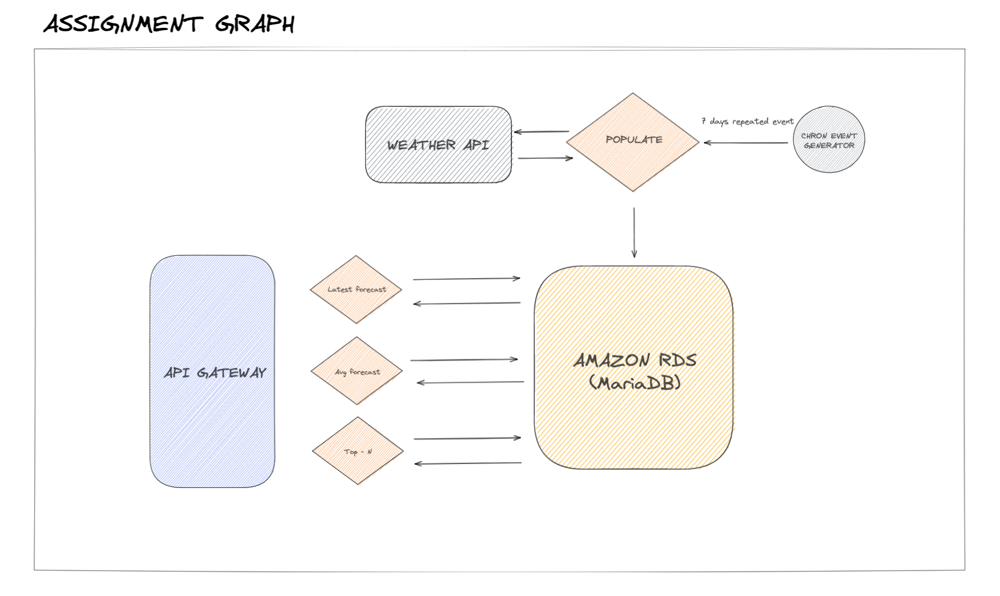

# weather-reports

## Architectural overview

The core concept of the solution is:

Create a chronjob that populates the database with the data for the upcoming days. The chronjob should be recurring and every 7 days.

The SQL database includes two tables <br><br>
\*\*\* Enter dB schema here
<br><br>

Create an API with three endpoints to retrieve requested data.

##### Solution

I used AWS as the prefered cloud for the services.

- The chron job is handled by a lambda function that is triggered by external events (by CloudWatch), set to trigger every 7 days.
- To avoid continous usage of a server for an application that is not constantly expecting requests, we opt to a scallable and cost effective way, by using API Gateway. API Gateway will allow us to have the endpoints triggered/"wake up" only when requested.

#### Architecture Graph



### Easier to read SQL queries

#### Query 1

```
SELECT cities.name, tab.*
FROM(
	select max(applicable_date) as latest_date, forecast.*
	from forecast
	group by city_id
	order by applicable_date desc
) AS tab,
cities
WHERE city_id=cities.id
```

#### Query 2

```
WITH top_forecasts AS (
  SELECT f.*, ROW_NUMBER() OVER (PARTITION BY  city_id,DATE_FORMAT(applicable_date , '%Y-%m-%d ') ORDER BY applicable_date DESC) AS rn
  FROM forecast AS f
)

SELECT tops.city_id, cities.name, avg(cur_temp), DATE_FORMAT(applicable_date , '%Y-%m-%d ') as the_day
FROM (
	SELECT *
	FROM top_forecasts
	where rn<=3
) as tops, cities
where  tops.city_id=cities.id
group by DATE_FORMAT(applicable_date , '%Y-%m-%d '), tops.city_id
```

#### Query(ies) 3

```

SELECT cities.name, humidity FROM forecast, cities where cities.id=city_id ORDER BY humidity  DESC LIMIT 3;
SELECT cities.name, max_temp FROM forecast, cities where cities.id=city_id ORDER BY max_temp  DESC LIMIT 3;
SELECT cities.name, air_pressure FROM forecast, cities where cities.id=city_id ORDER BY air_pressure  DESC LIMIT 3;
SELECT cities.name, min_temp FROM forecast, cities where cities.id=city_id ORDER BY min_temp  DESC LIMIT 3;
SELECT cities.name, cur_temp FROM forecast, cities where cities.id=city_id ORDER BY cur_temp  DESC LIMIT 3;
SELECT cities.name, visibility FROM forecast, cities where cities.id=city_id ORDER BY visibility  DESC LIMIT 3;
SELECT cities.name, wind_speed FROM forecast, cities where cities.id=city_id ORDER BY wind_speed  DESC LIMIT 3;

```

### Hardest parts

- Create the architecture
  - Decide on EC2 vs API Gateway
  - Lambda chronjob vs API Gateway
- Connect Lambda to Database (some work explained bellow)
- 2nd SQL question (some feedback from an experienced SQL users would be great)
- Deploying the API Gateway (in progress)

<br><br><br>

### Implications

- Lambda function virtual env for python that includes the packages required to run.
- The Lambda function does not have proper "view" of the DB. It required it to be in the same VPN. After some searching, I was able to debugg this issue

- The provided Lambda execution role does not have permissions to call CreateNetworkInterface on EC2
  Attached policy AWSLambdaVPCAccessExecutionRole to allow the lambda function to make changes in the VPC - Now Lambda and DB are in the same VPC and can can access each other

- https://aws.amazon.com/premiumsupport/knowledge-center/internet-access-lambda-function/ Allow Lambda to perform outbound requests
- https://stackoverflow.com/questions/56895635/aws-lambda-timeout-when-making-external-https-request -

* _Stopping since this requires about 32$ /mo_

### Biggests Assists from

- https://help.dreamhost.com/hc/en-us/articles/115000695551-Installing-and-using-virtualenv-with-Python-3
- https://medium.com/bi3-technologies/creating-python-deployment-package-for-aws-lambda-function-25205f033ac5
- https://www.serverless.com/blog/serverless-python-packaging -https://aws.amazon.com/blogs/compute/using-amazon-api-gateway-as-a-proxy-for-dynamodb/ - For API Gateway
